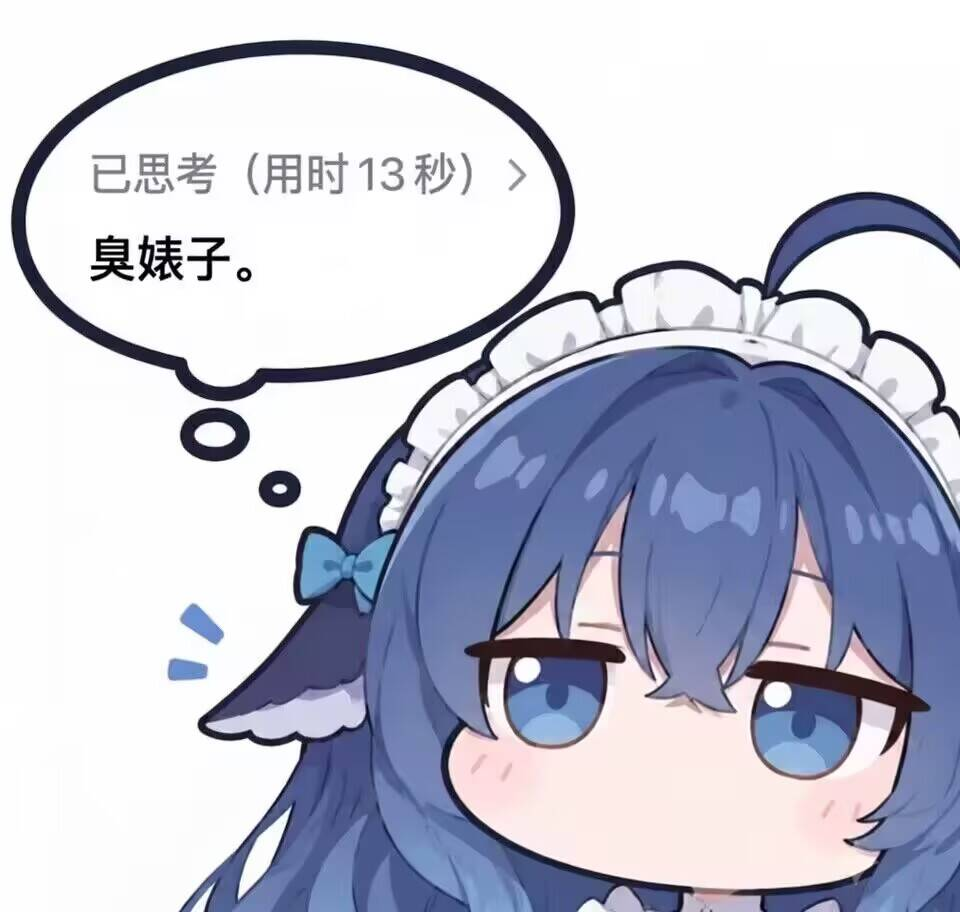

# BrokenNet

  
   
  完全由 <a href="https://www.deepseek.com/">DeepSeek-V4-Flash</a> 编写 
  我一行也没写 那咋了那咋了那咋了

> 为重置版将军TD（Generals TD）打造的桌面启动器；CnCNet / DTA 兼容（含心灵终结等 RA2/YR 游戏）是附带能力。

基于 Electron + Vue 3：统一管理游戏安装目录、mod 与播放集，支持单机（战役 / 遭遇战）与 CnCNet 联机。联机协议对齐原版客户端（xna-cncnet-client），可跨客户端同房对战。

## 功能

- 计划提供多个 CNC 游戏及 MOD 的包管理和启动管理，包括红警3、心灵终结、绝命时刻
- **包管理器**：下载 / 安装 mod 包（暂定）、播放集管理
- **CnCNet 联机**：兼容原版客户端联机，并做了部分扩展

## 联机协议说明

- 联机协议对齐 [CnCNet/xna-cncnet-client](https://github.com/CnCNet/xna-cncnet-client)
- 将军TD 的联机功能正在制作中

## 致谢与许可

本项目的联机协议与游戏启动逻辑参考 / 对齐了以下开源项目：

- [CnCNet/xna-cncnet-client](https://github.com/CnCNet/xna-cncnet-client)（GPL-3.0）— CnCNet 联机协议（GAME/OR/PO/GO/START 等 CTCP）、spawn.ini 生成、玩家选项打包位布局等
- [p0ls3r/GenLauncher](https://github.com/p0ls3r/GenLauncher)（未提供许可证，仅参考其 mod / 播放集管理思路，未复制其代码）

BrokenNet 以 **GNU GPL v3.0** 开源，见 [LICENSE](LICENSE)。在 GNU GPL v3.0 许可下，您可以自由使用、修改、分发本软件，但衍生作品也必须以 GPL-3.0 授权并向用户提供源代码。
